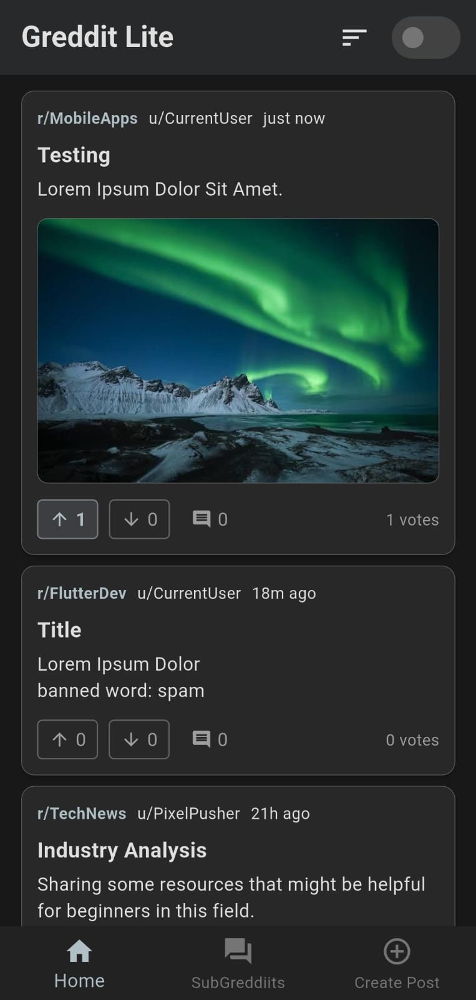

# Greddit Lite (Mobile Version)

This is a "lite" mobile version of a Reddit-like application called Greddit, built with Flutter. It allows users to browse posts, view communities (SubGreddiits), create new posts, and use simple moderation tools. The application is designed to work offline by storing all data locally.

<p align="center">
    
    <video src="assets/greddit_demo.mp4" width="300" controls style="display:inline-block; vertical-align:top;"></video>
</p>


## Features

This project successfully implements all the core requirements and optional features outlined in the assignment.

### Core Features

*   **Home Screen:** Displays a unified feed of all posts from every SubGreddiit. Each post card shows the title, body, author, SubGreddiit name, comment count, and vote buttons.
*   **SubGreddiit Screen:**
    *   Lists all available SubGreddiits.
    *   Allows users to tap on a SubGreddiit to view a dedicated feed of its posts.
    *   Features a "Join/Leave" toggle for each SubGreddiit, with the state managed locally.
*   **Create Post Screen:**
    *   A user-friendly form to create a new post.
    *   Users can select a SubGreddiit from a dropdown menu.
    *   Supports adding a title, body text, and an optional image from the phone's gallery.
    *   New posts are saved locally and appear in the appropriate feeds.
*   **Moderator Mode:**
    *   A global toggle switch available on the Home Screen.
    *   When enabled, a delete icon appears next to each post, allowing for removal.
    *   Automatically identifies and grays out posts containing banned words (e.g., "spam," "stupid," "ads").

### Bonus Features

*   **State Management:** Uses **Flutter Riverpod** for robust and scalable state management across the app.
*   **Search Functionality:** A search bar is implemented on the SubGreddiits screen to easily filter communities by name, description, or tags.
*   **Post Sorting:** The post feeds on both the Home Screen and individual SubGreddiit screens can be sorted by **Newest**, **Top**, and **Controversial**.
*   **SubGreddiit Tags:** Communities have associated tags, which are displayed and used in search functionality.

## Getting Started

Follow these instructions to get a copy of the project up and running on your local machine for development and testing.

### Prerequisites

*   [Flutter SDK](https://flutter.dev/docs/get-started/install)
*   [Android Studio](https://developer.android.com/studio) with the Android SDK and command-line tools.
*   A configured Android device or emulator.

### Installation & Running

1.  **Clone the repository:**
    ```sh
    git clone <your-repo-url>
    cd greddit
    ```

2.  **Install dependencies:**
    ```sh
    flutter pub get
    ```

3.  **Run the app:**
    Connect your Android device or start an emulator, then run the following command:
    ```sh
    flutter run
    ```

4.  **Build the APK:**
    To generate a release APK, run:
    ```sh
    flutter build apk
    ```
    The output file will be located at `build/app/outputs/flutter-apk/app-release.apk`. You can install this file on an Android device.